# Personalized Learning Plan Module — Step-by-Step Approach

## Current Architecture Snapshot

```mermaid
graph LR
    A["Register/Login"] --> B["Diagnostic Assessment<br/>(3-stage)"]
    B --> C["Assessment Result<br/>(score + proficiency)"]
    C --> D["Learning Path<br/>(milestone roadmap)"]
    D --> E["Pronunciation Coach<br/>(voice practice)"]
    
    style A fill:#064e3b,stroke:#10b981
    style B fill:#064e3b,stroke:#10b981
    style C fill:#064e3b,stroke:#10b981
    style D fill:#064e3b,stroke:#10b981
    style E fill:#78350f,stroke:#f59e0b
```



### What Already Exists

| Layer | Component | Status |
|-------|-----------|--------|
| **DB Schema** | `LearningPath`, `PathLesson`, `Recommendation`, `ProgressTracking` tables | ✅ Tables exist but **underutilized** |
| **Backend** | `learning_path.py` — `/active`, `/generate`, `/lesson/{id}/status` | ⚠️ Uses hardcoded `LANGUAGE_CONTENT` fallback instead of DB |
| **Backend** | `assessment.py` — `/submit` returns milestones | ✅ Works but milestones are static per proficiency level |
| **Frontend** | `LearningPath.jsx` — milestone roadmap UI | ✅ Renders but no per-user personalization |
| **DB Schema** | `AssessmentResult`, `PronunciationScore` tables | ✅ Exist but not queried for personalization |
| **DB Seed** | 12 lessons, 6 questions, 6 curricula, 8 modules | ✅ Available for mapping |

### What's Missing for True Personalization

| Gap | Description |
|-----|-------------|
| **No learner-specific path generation** | All users at the same proficiency level get identical milestones |
| **No weak-area detection** | Assessment scores are calculated but not broken into granular skill gaps |
| **No adaptive lesson ordering** | Lessons are sequenced statically (step 1→2→3), not based on individual needs |
| **No progress-driven re-planning** | Path doesn't update as the learner completes lessons or scores change |
| **No recommendation engine** | `Recommendation` table exists but nothing writes to it |
| **No quiz/content completion tracking** | `ProgressTracking` table exists but no endpoints use it |

---

## Step-by-Step Implementation Approach

### Phase 1: Build the Learner Profile Engine

**Goal**: Capture enough data about each learner to make personalization decisions.

#### Step 1.1 — Enrich the Assessment Result Storage

Currently, `/api/assessment/submit` calculates `reading_score`, `comprehension_score`, and `voice_score` but only returns them — it doesn't persist individual skill scores.

- **Action**: After computing scores in `assessment.py`, write individual results to the `AssessmentResult` table (one row per question answered).
- **Map each answer** to its `question_id` from `AssessmentQuestion` table.
- **Why**: This gives you historical data per learner — you can later query "what did this learner get wrong?" to personalize their path.

#### Step 1.2 — Populate LearnerProfile with Skill Breakdown

The `LearnerProfile` table has `literacy_level` but no granular skill data.

- **Action**: Add 3 new columns to `LearnerProfile`: `reading_pct` (float), `comprehension_pct` (float), `voice_pct` (float). These store the percentage scores from the diagnostic.
- **When to update**: Every time an assessment is submitted AND every time a lesson quiz is completed.
- **Why**: These percentages become the input signals for the personalization algorithm.

#### Step 1.3 — Track the Learner's Language Preference

`Learner.current_lang_id` exists but isn't consistently used.

- **Action**: Ensure the language selected during registration/assessment is stored in `current_lang_id`. The learning path generator should always filter content by this language.

---

### Phase 2: Build the Adaptive Path Generation Algorithm

**Goal**: Generate a unique learning path per user based on their specific weaknesses.

#### Step 2.1 — Define the Personalization Rules

Design a rule-based algorithm (no ML needed) that maps skill gaps to lesson priorities:

| Skill Gap | Rule | Action |
|-----------|------|--------|
| Reading < 50% | Learner struggles with phonics | Prioritize **Module: Alphabets & Phonics** and **Everyday Greetings** lessons |
| Comprehension < 50% | Learner struggles with functional reading | Prioritize **ATM & Banking**, **Health & Prescription**, **Digital Payment** lessons |
| Voice < 50% | Learner struggles with pronunciation | Prioritize **Workplace Communication**, **Customer Service Dialogue** lessons + extra voice practice |
| All skills ≥ 70% | Learner is strong across the board | Skip foundational → jump to functional/advanced modules |

#### Step 2.2 — Implement the Path Generator Function

Create a new function `generate_personalized_path(learner_id, db)` in `learning_path.py`:

```
INPUT:  learner_id
QUERY:  LearnerProfile → get reading_pct, comprehension_pct, voice_pct, literacy_level
QUERY:  Learner → get current_lang_id
QUERY:  Curriculum → filter by lang_id + matching level
QUERY:  Module → filter by curriculum_id, order by sequence_no
QUERY:  Lesson → filter by module_id

ALGORITHM:
  1. Identify weakest skill (lowest of reading/comprehension/voice)
  2. Map weakest skill to relevant skill_type in Module table
     - reading    → skill_type = "READING"
     - comprehension → skill_type = "COMPREHENSION"  
     - voice      → skill_type = "VOICE"
  3. Sort modules: weak-skill modules FIRST, then others
  4. Within each module, sort lessons by difficulty_level (FOUNDATIONAL → FUNCTIONAL → PROFICIENT)
  5. Create LearningPath record in DB
  6. Create PathLesson records for each lesson in the sorted order
  7. Mark first 2 lessons as UNLOCKED, rest as LOCKED

OUTPUT: Structured path with milestones grouped by module
```

#### Step 2.3 — Replace Hardcoded Fallback with DB-Driven Content

Currently, `learning_path.py` uses the `LANGUAGE_CONTENT` dictionary as a fallback. Replace this with actual DB queries:

- Query `Curriculum` filtered by `lang_id` → get matching curricula
- Query `Module` filtered by `curriculum_id` → get modules (these become milestones)
- Query `Lesson` filtered by `module_id` → get lessons within each milestone
- The `LANGUAGE_CONTENT` dict should only be used as a **last resort** when DB has no data for a language

---

### Phase 3: Build the Progress-Driven Re-Planning System

**Goal**: The learning path should evolve as the learner completes lessons.

#### Step 3.1 — Implement Lesson Completion Tracking

When a learner finishes a lesson (completes voice practice with a passing score):

1. Update `PathLesson.status` → `COMPLETED`
2. Write to `ProgressTracking` table: `learner_id`, `module_id`, `completion_pct`, `time_spent_min`
3. Write to `PronunciationScore` table: accuracy scores from the voice practice
4. **Auto-unlock the next lesson**: Find the next `PathLesson` in sequence and set status → `UNLOCKED`
5. **Update milestone completion**: Recalculate `completion_pct` for the module

#### Step 3.2 — Implement Milestone Completion & Unlock Logic

When all lessons in a milestone are COMPLETED:

1. Mark the milestone as COMPLETED
2. Unlock the next milestone's lessons
3. **Re-evaluate**: Query the learner's updated scores (from `PronunciationScore` and any quiz results). If a previously weak skill has improved, the next milestone's lesson order may shift.
4. Update `LearningPath.current_level` if the learner has progressed to a new proficiency tier

#### Step 3.3 — Build the Re-Planning Trigger

After every 3 completed lessons OR after a module quiz, re-run a lightweight version of the personalization algorithm:

- Recalculate `reading_pct`, `comprehension_pct`, `voice_pct` from recent scores
- If the weakest skill has changed (e.g., reading was weakest, now voice is), re-order remaining LOCKED lessons
- This makes the path truly **adaptive** — it responds to real learning progress

---

### Phase 4: Build the Recommendation Engine

**Goal**: Suggest "what to do next" using the existing `Recommendation` table.

#### Step 4.1 — Define Recommendation Types

| Priority | Type | Trigger |
|----------|------|---------|
| HIGH | "Practice weak area" | Skill score < 50% after last quiz |
| MEDIUM | "Continue current module" | Learner has unlocked but incomplete lessons |
| LOW | "Try a new module" | Current module is 80%+ complete |

#### Step 4.2 — Implement the Recommendation Writer

Create a function `generate_recommendations(learner_id, db)`:

1. Query latest `PronunciationScore` records → find weakest lesson category
2. Query `PathLesson` → find next unlocked but not started lesson
3. Query `ProgressTracking` → find modules with low completion
4. Write 2-3 rows to `Recommendation` table with `reason` and `priority`

#### Step 4.3 — Create the Recommendation API

- `GET /api/recommendations/{learner_id}` → returns top 3 recommendations
- Frontend displays these as "Suggested Next Steps" cards on the dashboard and at the bottom of the Learning Path view

---

### Phase 5: Frontend Integration

**Goal**: Wire everything into the existing UI.

#### Step 5.1 — Update LearningPath.jsx

Current `LearningPath.jsx` receives static milestones. Update it to:

- Fetch from `GET /api/learning-path/active?lang={iso_code}` (already exists)
- Ensure the backend now returns **personalized, DB-driven** milestones (from Phase 2)
- Show a **"Why this path?"** tooltip on each milestone explaining why it was prioritized (e.g., "Prioritized because your reading score is 35%")
- Add lesson completion callbacks that hit `PATCH /api/learning-path/lesson/{id}/status`

#### Step 5.2 — Add Lesson Completion Flow in App.jsx

When `PronunciationCoach` finishes (user gets a score):

1. Call `PATCH /api/learning-path/lesson/{id}/status` with `COMPLETED`
2. Show a "Lesson Complete!" animation
3. Navigate back to Learning Path (which now shows updated progress)
4. The next lesson auto-unlocks

#### Step 5.3 — Add Recommendation Cards to Dashboard

Replace the static dashboard in `App.jsx` with:

- Dynamic stats from `GET /api/progress/dashboard`
- A "Recommended Next" section fed by `GET /api/recommendations/{learner_id}`
- Each card shows the lesson title, reason, and a "Start" button

---

### Phase 6: Multi-User Differentiation

**Goal**: Ensure two learners at the same proficiency level get different paths.

#### How Two "FUNCTIONAL" Learners Get Different Paths

```
Learner A (FUNCTIONAL):
  - reading: 60%, comprehension: 30%, voice: 45%
  - WEAKEST: comprehension
  - PATH: ATM Banking → Health Prescription → Digital Payment → then voice practice

Learner B (FUNCTIONAL):
  - reading: 25%, comprehension: 65%, voice: 50%
  - WEAKEST: reading
  - PATH: Alphabets & Phonics → Everyday Greetings → Numbers → then comprehension
```

The differentiation comes from:
1. **Skill breakdown** (which skill is weakest)
2. **Language** (Hindi vs Tamil vs English content)
3. **Progress history** (what they've already completed)
4. **Recency** (recent scores matter more than old ones)

---

## Implementation Order (Recommended)

```mermaid
graph TD
    P1["Phase 1: Learner Profile Engine<br/>~2 days"] --> P2["Phase 2: Adaptive Path Algorithm<br/>~3 days"]
    P2 --> P3["Phase 3: Progress Re-Planning<br/>~2 days"]
    P3 --> P4["Phase 4: Recommendation Engine<br/>~1 day"]
    P4 --> P5["Phase 5: Frontend Integration<br/>~2 days"]
    P5 --> P6["Phase 6: Multi-User Testing<br/>~1 day"]
    
    style P1 fill:#064e3b,stroke:#10b981
    style P2 fill:#1e3a5f,stroke:#3b82f6
    style P3 fill:#78350f,stroke:#f59e0b
    style P4 fill:#581c87,stroke:#a855f7
    style P5 fill:#064e3b,stroke:#10b981
    style P6 fill:#1e3a5f,stroke:#3b82f6
```



## Files That Will Be Touched

| File | What Changes |
|------|-------------|
| `backend/app/models.py` | Add `reading_pct`, `comprehension_pct`, `voice_pct` to `LearnerProfile` |
| `backend/app/routers/assessment.py` | Persist individual `AssessmentResult` rows + update `LearnerProfile` skill scores |
| `backend/app/routers/learning_path.py` | Replace `LANGUAGE_CONTENT` fallback with DB-driven personalized algorithm |
| `backend/app/routers/progress.py` | **NEW** — Lesson completion tracking + dashboard aggregation |
| `backend/app/routers/recommendation.py` | **NEW** — Recommendation generator + API |
| `backend/app/main.py` | Register new routers |
| `frontend/src/components/LearningPath.jsx` | Add completion callbacks, "why this path" tooltips |
| `frontend/src/App.jsx` | Wire lesson completion flow, add recommendation display |
| `frontend/src/services/api.js` | Add progress + recommendation API calls |

> [!TIP]
> The biggest win comes from **Phase 2** (adaptive algorithm). Everything else is support infrastructure. If you're short on time, implement Phase 1 + Phase 2 first — that alone gives you a working personalized learning plan.
